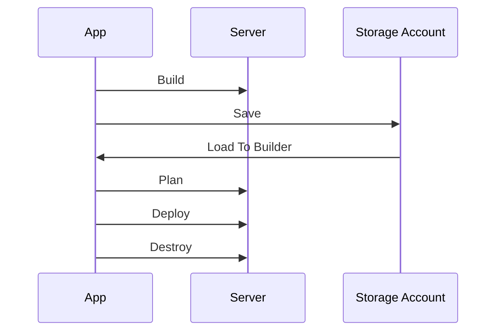
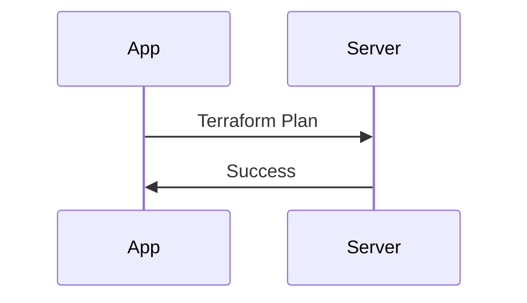
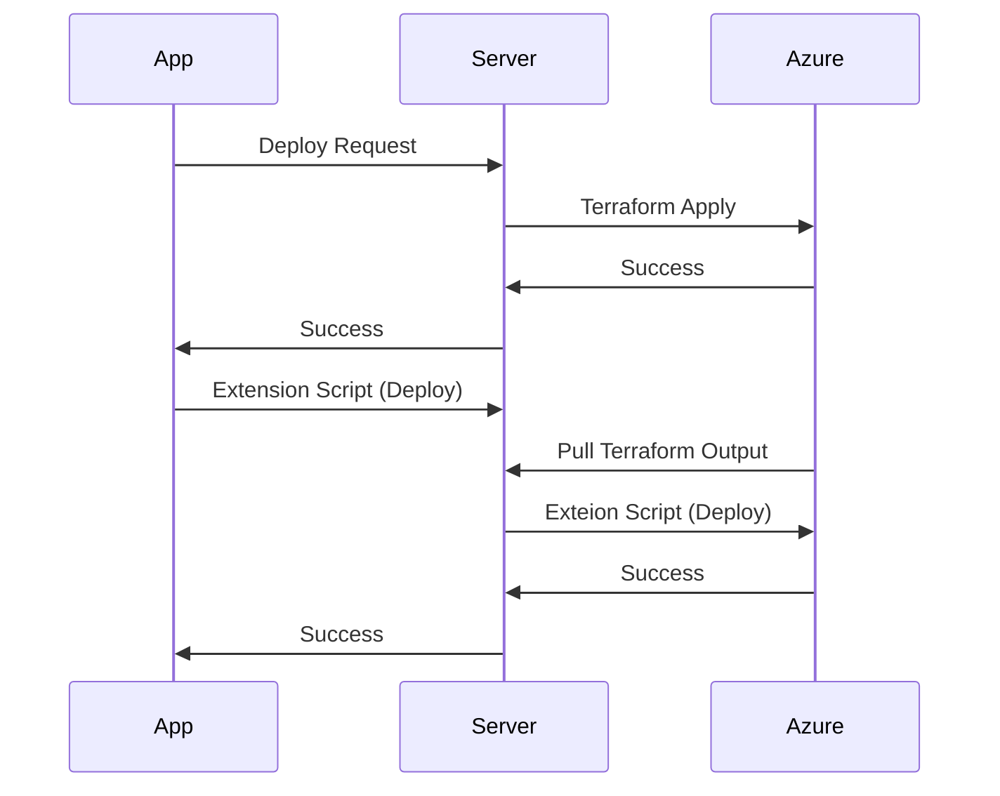
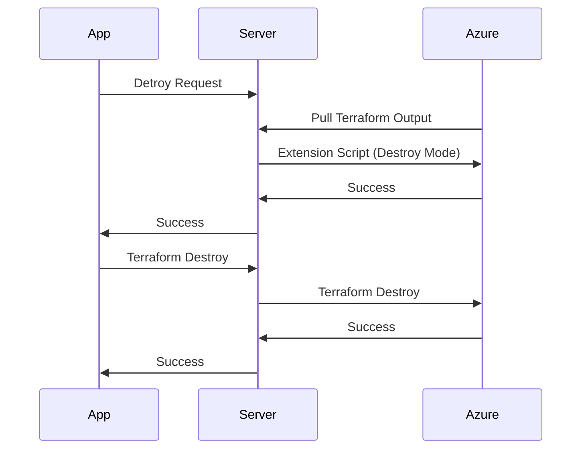

# One Click AKS: Simplest way to deploy Complex AKS Cluster

<!-- START doctoc generated TOC please keep comment here to allow auto update -->
<!-- DON'T EDIT THIS SECTION, INSTEAD RE-RUN doctoc TO UPDATE -->

- [Introduction](#introduction)
- [Getting Started](#getting-started)
- [Server](#server)
- [Builder](#builder)
  - [Lab](#lab)
  - [Template](#template)
  - [Extension Script](#extension-script)
    - [How this works?](#how-this-works)
      - [Deploy (Extend) Mode](#deploy-extend-mode)
      - [Destroy Mode](#destroy-mode)
    - [Environment Variables](#environment-variables)
    - [Shared Functions](#shared-functions)
  - [Lab Lifecycle](#lab-lifecycle)
    - [Build](#build)
    - [Plan](#plan)
      - [Plan Flow](#plan-flow)
    - [Deploy](#deploy)
      - [Deployment Fow](#deployment-fow)
    - [Destroy](#destroy)
      - [Destroy Flow](#destroy-flow)
    - [Saving your lab](#saving-your-lab)
    - [Sharing Lab](#sharing-lab)
- [Learning](#learning)
- [Labs](#labs)
  - [How to create a lab exercise?](#how-to-create-a-lab-exercise)
  - [How to assign lab exercise?](#how-to-assign-lab-exercise)
- [Mock Cases](#mock-cases)
  - [How to create a mock case?](#how-to-create-a-mock-case)
  - [How to deploy a mock case?](#how-to-deploy-a-mock-case)

<!-- END doctoc generated TOC please keep comment here to allow auto update -->

## Introduction

Deploying Azure Kubernetes Cluster is really easy. You can create production grade cluster with couple CLI commands. So what this project brings to the table you ask.
There are hundereds of ways that an AKS cluster can be deployed in and then thousands more to configure and meet your unique requirements. If you have to deploy AKS with differnet configurations over and over again its no more an easy task. Along comes this project.
This project runs locally on your computer and deploys AKS cluster in many different ways. (not all)

## Getting Started

To get started, headover to [ACT Labs Start](https://actlabs.azureedge.net/start) page and follow the simple setup wizard.

This setup wizard will help you with following.

- Running server on your computer.
- Select your Azure Subscription.
- Authenticate Azure CLI
- Create Storage Account
  - Storage Account will get a random generated name.
  - You can see this storage account name in settings.
  - This storage account will be created in a resource group named 'repro-project' in your selected subscription.
  - You will see that two containers are created in this storage account.
    - **tfstate**: terraform state files will be stored in this container.
    - **labs**: the labs that you will save will be stored in this container.

Important points to note

- All your data is stored in a storage account in '_repro-project_' resource group of your subscription. If you delete this storage account, all data will be lost. We don't keep a copy of your data.
- Make sure there is exactly one storage account in '_repro-project_' resource group. If you create additional storage accounts in this resource-group, you will see unexpected behaviors.

> If this is the first time you are setting up. It will take sometime to download the image. After its cached it should be faster every othertime.

## Server

The server you started in docker is a ubuntu VM with following components installed on it.

- Azure CLI
- Terraform
- Go
- Helm
- Git
- kubectl
- openshift cli
- redis

## Builder

[Builder](https://actlabs.azureedge.net/builder) is used to build a [lab](#lab)

### Lab

In simplest term a Lab is a scenario that you would want to create. For example, you may want to create an AKS cluster with following specifications.

- Create a VNET
- Create an Azure Firewall
- Add all required Egress rules to Azure Firewall.
- Create a Private AKS Cluster with UDR
- Create a Jump Server in VNET with Public IP to SSH and hop to access your private cluster.

or maybe,

- Create a VNET
- Create a Private AKS Cluster with Standard LB
- Deploy Ingress Nginx controller and a dummy app on this cluster.

You can use this tool to create and deploy labs. Labs can be saved for re-use in future, exported and shared with others and imported to the tool.

To create, deploy, import or export a lab, you can use [Builder](#builder)

This is what a lab object looks like.

```json
{
 "id": "",
 "name": "",
 "description": "",
 "tags": [],
 "template": {
  "resourceGroup": {
   "location": "East US"
  },
  "virtualNetworks": [],
  "subnets": [],
  "jumpservers": [],
  "networkSecurityGroups": [],
  "kubernetesClusters": [
   {
   "kubernetesVersion": "1.24.9",
   "networkPlugin": "kubenet",
   "networkPolicy": "null",
   "networkPluginMode": "null",
   "outboundType": "loadBalancer",
   "privateClusterEnabled": "false",
   "addons": {
    "appGateway": false,
    "microsoftDefender": false
   },
   "defaultNodePool": {
    "enableAutoScaling": false,
    "minCount": 1,
    "maxCount": 1
   }
   }
  ],
  "firewalls": [],
  "containerRegistries": [],
  "appGateways": []
 },
 "extendScript": "removed for simplicity of docs",
 "message": "",
 "type": "template",
 "createdBy": "",
 "createdOn": "",
 "updatedBy": "",
 "updatedOn": ""
}
```

Lab consists of two important parts.

- [Template](#template)
- [Extension Script](#extension-script)

### Template

Template is a collection of objects and is part of lab object. For example in the object share above, following is the template.

```json
"template": {
  "resourceGroup": {
   "location": "East US"
  },
  "virtualNetworks": [],
  "subnets": [],
  "jumpservers": [],
  "networkSecurityGroups": [],
  "kubernetesClusters": [
   {
   "kubernetesVersion": "1.24.9",
   "networkPlugin": "kubenet",
   "networkPolicy": "null",
   "networkPluginMode": "null",
   "outboundType": "loadBalancer",
   "privateClusterEnabled": "false",
   "addons": {
    "appGateway": false,
    "microsoftDefender": false
   },
   "defaultNodePool": {
    "enableAutoScaling": false,
    "minCount": 1,
    "maxCount": 1
   }
   }
  ],
  "firewalls": [],
  "containerRegistries": [],
  "appGateways": []
 }
```

Go server running in docker container translates this template to TF_VAR environment variables which are then used by [Terraform](#builder) code to deploy resources the way desired. We use [builder](#builder) to modify the template which then influences what the targeted deployment would look like.

Template is already providing us greater flexibility in acheiving complex scenarios with ease. But, its not doing it all. And, probably will never be able to. To achieve more flexibility, we have [Extension Script](#extension-script).

### Extension Script

Extension script gives you the ability to go beyond what this tool can do out of the box and be really creative. You can use this to do everything that can be done using Azure CLI. Some examples use cases are:

- Pulling an image from docker hub to your ACR.
- Deploy an application to Kubernetes cluster.
- Adding additional node pools to your cluster.
- Ordering food online for free. Well, not that, but you get the idea.

#### How this works?

This script runs in two primary modes.

- Deploy
- Destroy

##### Deploy (Extend) Mode

When click '**Deploy**' button, the base infra is deployed using terraform code. After that completes successfully, extension script is deployed. Both these steps happen automatically in order. Since extension script runs after terraform apply is finished. It has access to terraform output.
When running in deploy (extend) mode, 'extend' function is called.

```bash
function extend() {
 # Add your code here to be executed after apply
 ok "nothing to extend"
}
```

_See [deployment flow](#deployment-fow)_

##### Destroy Mode

When click '**Destroy**' button, first, extension script runs in destroy mode, and lets you delete the resources that were created in deploy mode. Or do any other activity that must be done gracefully before resources are destroyed.
When running in destroy mode, 'destroy' function is called.

```bash
function destroy() {
 # Add your code here to be executed before destruction
 ok "nothing to destroy"
}
```

_See [destroy flow](#destroy-flow)_

#### Environment Variables

Following environment variables are available for script to use. There may be other variables that are not in this list. Any terraform output is automatically added as an even variable for extension script. For example, terraform output "resource_group" is automatically added as an env variable "RESOURCE_GROUP". You can see entire terraform output in the deployment logs.
| Variable | Description |
| ------------------- | ------------------------------------------------------------------------------------------------------------------------------------------------------------------------------------------------------------------- |
| RESOURCE_GROUP | Name of the resource group in azure. This is where all resources will be deployed. Please note if you create additional resource groups using extension script you need to manage the deleting in destroy function. |
| ACR_NAME | Name of the ACR if deployed |
| AKS_LOGIN | Command to login to the AKS Cluster if deployed |
| CLUSTER_NAME | Name of AKS Cluster if deployed |
| CLUSTER_VERSION | Version of AKS Cluster if deployed |
| FIREWALL_PRIVATE_IP | Private IP address of the firewall. |
| NSG_NAME | Name of the NSG associated with subnet where AKS cluster is deployed, you can use this to add/remove rules using extension scripts" |
| LOCATION | This is the Azure Region where the resources are deployed. None of the resources are given region exclusively. They all inherit it from resource group. |
| VNET_NAME | Name of the virtual network. |
| CLUSTER_MSI_ID | Clusters managed identity ID. |
| KUBELET_MSI_ID | Kubelet's managed identity |

#### Shared Functions

There are few things that almost all scripts will do. We are aware of these and added them as shared functions which are available to the script and are ready for use.

- Loging
    `function log()`
    Args: "string"
    Example: `log "this statement will be logged"`

```bash
log() {
  echo -e "[$(date +'%Y-%m-%dT%H:%M:%S%z')]: INFO - $*" >&1
}

log "this statement will be logged in normal font"
```

- Green (OK) Logging
    `function ok()`
    Args: "string"
    Example: `ok "this statement will be logged as INFO log in green color"`

```bash
ok() {
  echo -e "${GREEN}[$(date +'%Y-%m-%dT%H:%M:%S%z')]: INFO - $* ${NC}" >&1
}

ok "this statement will be logged in green color"
```

- Error Logging
    `function err()`
    Args: "string"
    Example: `err "this error occrured"`

```bash
err() {
  echo -e "${RED}[$(date +'%Y-%m-%dT%H:%M:%S%z')]: ERROR - $* ${NC}" >&1
}

err "this statement wil logged in red color"
```

In addition to these, we figured that there are few things that we will be doing over and over again in extension scripts. Ultimate goal is to add them as a flag (Switch Button) and make part of terraform, but as an interim solution they are provided as shared functions.

- Deploy ARO Cluster

```bash
function deployAROCluster() {

    # Set the cluster name, and network name variables
    ARO_CLUSTER_NAME="${PREFIX}-aro"

    az group show --name ${RESOURCE_GROUP} --output none > /dev/null 2>&1
    if [ $? -ne 0 ]; then
        err "Resource Group not found. Skipped creating cluster."
        return 1
    fi

    # Deploy the cluster
    log "deploying aro cluster"
    az aro create \
    --resource-group ${RESOURCE_GROUP} \
    --name ${ARO_CLUSTER_NAME} \
    --location ${LOCATION} \
    --vnet ${VNET_NAME} \
    --master-subnet AROMasterSubnet \
    --worker-subnet AROWorkerSubnet \
    --no-wait
    if [ $? -ne 0 ]; then
        err "Command to create ARO Cluster failed."
        return 1
    fi

    # Wait for the cluster to be ready
    counter=0
    ok "waiting for cluster to be created. this can take several minutes, script will wait for an hour."
    while true; do
        status=$(az aro show --resource-group ${RESOURCE_GROUP} --name ${ARO_CLUSTER_NAME} --query provisioningState -o tsv)
        
        if [[ ${status} == "Succeeded" ]]; then
            ok "cluster created."
            break
        fi
        
        if [[ ${counter} -eq 3600 ]]; then
            err "enough wait.. the cluster is no ready yet. please check from portal"
            break
        fi
        
        
        counter=$((${counter}+30))
        sleep 30

        if [[ ${status} == "Creating" ]]; then
            log "cluster state is still 'Creating'. Sleeping for 30 seconds. $((${counter}/60)) minutes passed."
        else
            log "Wait time didn't finish and cluster state isn't 'Creating' anymore. $((${counter}/60)) minutes passed."
        fi
    done

    # Get the cluster credentials
    log "cluster credentials"
    az aro list-credentials --resource-group ${RESOURCE_GROUP} --name ${ARO_CLUSTER_NAME}

    pass=$(az aro list-credentials -g ${RESOURCE_GROUP} -n ${ARO_CLUSTER_NAME} --query kubeadminPassword -o tsv)
    apiServer=$(az aro show -g ${RESOURCE_GROUP} -n ${ARO_CLUSTER_NAME} --query apiserverProfile.url -o tsv)
    apiServerIp=$(az aro show -g ${RESOURCE_GROUP} -n ${ARO_CLUSTER_NAME} --query apiserverProfile.ip -o tsv)

    ok "Login command -> oc login $apiServer -u kubeadmin -p $pass --insecure-skip-tls-verify"
}
```

- Delete ARO Cluster

```bash
function deleteAROCluster() {

    # Set the cluster name, and network name variables
    ARO_CLUSTER_NAME="${PREFIX}-aro"

    # Deploy the cluster
    log "deleting aro cluster"
    az aro delete \
    --resource-group ${RESOURCE_GROUP} \
    --name ${ARO_CLUSTER_NAME} \
    --yes \
    --no-wait
    if [ $? -ne 0 ]; then
        err "Command to delete ARO Cluster failed."
        return 1
    fi

    # Wait for the cluster to be ready
    counter=0
    ok "waiting for cluster to be deleted. this can take several minutes, script will wait for an hour."
    while true; do
        status=$(az aro show --resource-group ${RESOURCE_GROUP} --name ${ARO_CLUSTER_NAME} --query provisioningState -o tsv)
        
        if [[ ${status} != "Deleting" ]]; then
            ok "cluster deleted."
            break
        fi
        
        if [[ ${counter} -eq 3600 ]]; then
            err "enough wait.. the cluster is not deleted yet. please investigate"
            break
        fi
        
        
        counter=$((${counter}+30))
        sleep 30

        if [[ ${status} == "Deleting" ]]; then
            log "cluster state is still 'Deleting'. Sleeping for 30 seconds. $((${counter}/60)) minutes passed."
        else
            log "Wait time didn't finish and cluster state isn't 'Deleting' anymore. $((${counter}/60)) minutes passed."
        fi
    done
}
```

- Deploy Ingress Nginx Controller.

```bash
function deployIngressNginxController() {
    # Deploy Ingress Controller.
    log "Deploying Ingress Controller"
    NAMESPACE=ingress-basic

    helm repo add ingress-nginx https://kubernetes.github.io/ingress-nginx
    helm repo update

    helm install ingress-nginx ingress-nginx/ingress-nginx \
    --create-namespace \
    --namespace $NAMESPACE

    # This loop is to wait for 5 minutes to ensure the external ip was allocated to the service.
    for i in {1..11}; do
        log "Checking external ip - Attemp $i"
        if [[ $i -eq 11 ]]; then
            err "Not able to secure external ip"
            exit 1
        fi
        EXTERNAL_IP=$(kubectl get svc/ingress-nginx-controller -n ingress-basic -o json | jq -r .status.loadBalancer.ingress[0].ip)
        if [[ "$EXTERNAL_IP" != "" ]]; then
            ok "External IP : $EXTERNAL_IP"
            break
        fi
        sleep 30s
    done
}
```

- Deploy Dummy App (HTTPBIN)

```bash
function deployHttpbin() {
cat <<EOF | kubectl apply -f -
apiVersion: apps/v1
kind: Deployment
metadata:
  name: httpbin
  labels:
    app: httpbin
spec:
  replicas: 1
  selector:
    matchLabels:
      app: httpbin
      role: frontend
  template:
    metadata:
      labels:
        app: httpbin
        role: frontend
    spec:
      containers:
        - name: httpbin
          image: kennethreitz/httpbin
          resources:
            requests:
              cpu: 500m
---
apiVersion: v1
kind: Service
metadata:
  name: httpbin
  labels:
    app: httpbin
spec:
  selector:
    app: httpbin
  ports:
    - protocol: TCP
      port: 80
      targetPort: 80
---
apiVersion: networking.k8s.io/v1
kind: Ingress
metadata:
  annotations:
    kubernetes.io/ingress.class: azure/application-gateway
  name: httpbin-ingress-agic
  namespace: default
spec:
  rules:
  - host: httpbin-agic.evaverma.com
    http:
      paths:
        - path: /
          pathType: Prefix
          backend:
            service:
              name: httpbin
              port:
                number: 80
EOF
}
```

### Lab Lifecycle



#### Build

A lab is built using [Builder](#builder). Flags in builder can be used to build a tempalte and if needed, extension script can be used to extend it even furhter. A lab is not [saved](#saving-your-lab) by default.

#### Plan

You can do a [`terraform plan`](https://developer.hashicorp.com/terraform/cli/commands/plan) using '_Plan_' button in [Builder](#builder). This will generate a terrafrom plan and you will be able to see output.

I highly recommend to run a plan before deploymnet just to be sure you dont accidently delete stuff you dont intend to.

_**Note**: [Extension script](#extension-script) is not tested/executed in plan mode_

##### Plan Flow



#### Deploy

In a nutshell this will deploy the lab. This is a two step process.

- [terraform apply](https://developer.hashicorp.com/terraform/cli/commands/apply) - when you hit _'Deploy'_ button, first, terraform part of the lab is deployed. The lab object contains 'template' object. These are the values that server will translate to terraform variables and set them as environment variables in [server](#server). After the terraform apply is successfuly, [execention script](#extension-script) will be executed.

##### Deployment Fow



- [extension script](#extension-script) - extension script is a huge topic, its covered in its own section.

_**Note:** Its important that you [Plan](#plan) before deploymnet to avoid accidently deleting stuff that you dont want to._

#### Destroy

You can destroy the resources created with this tool by using '_Destroy_' button. It executes [extension script](#destroy-mode) in destroy mode and then executes [terraform destroy](https://developer.hashicorp.com/terraform/cli/commands/destroy)

##### Destroy Flow



#### Saving your lab

You should be able to recreate simple scenarios easily. But for complex scenarios especially when you end up using [Extension Script](#extension-script) then it becomes absolutely necessary to save your work. You can use '_Save_' button in [Builder](#builder) to save your work. You will be presented with a form and following information will be requested.

- **Name:**: I know it's hard to name stuff. But try your best to give one liner introduction of your lab.
- **Description**: Add as much information as humanly possible. It's important that you get the idea of what this lab does when you come back later after a month and shouldn't have to read the extension script. trust me, it's important.
- **Tags**: Plan is to add search feature later which will help you find labs based on tags, something like tags in stack overflow.
- **Template**: This is auto populated.
- **Extension Script**: This is auto populated.

- **Update**: This will update the existing lab.
- **Save as New**: This will save as a new lab. Use this to make a copy of your existing lab.

#### Sharing Lab

- **Export** - You can use '_Export_' button in [Builder](#builder) to export lab to a file, which then can be shared with anyone, and they can use this to import and use.
- **Import** - You can use '_Import_' button in [Builder](#builder) to import lab from a file. You can then [Save](#saving-your-lab) it in your templates.
- **[Shared Templates](https://actlabs.azureedge.net/templates)** - There are some pre-built labs that you can use to get a head start.
- **Contributing to shared templates.** - _Coming soon_

## Learning

If you are going thru L100 or other internal trainings, you will be assigned labs by your mentor. Once the labs are assigned you should be able to see them here. If you dont see any labs, none is assigned to you.

After a lab is assigned you can

- [Deploy](#deploy)
- Troubleshoot and fix the problem.
- Use '_Validate_' button to check if the fix you applied is valid.
- After successful validatio, get in touch with your mentor.
- [Destroy](#destroy)

> If you are planning to work multiple labs at once you need to use different worksapces for each lab. Check Terraform > Workspaces.

## Labs

> This part of tool is only accessible to ACT Readiness team. If you are not able to access/view this but should be please reachout to ACT Readiness Team.

### How to create a lab exercise?

Labs for Readiness traning can be built using [Builder](#builder). When saving lab, select '_labexercise_' as the type of lab. One additional requirement readiniess labs has is the validation script which is part of extension-script. You can write validation code in `function validate()` section of the script and it will be run when user hits '_Validate_' button in [Learning](#learning) section on the assigned lab. For any additional questions, please reachout to readiness team.

### How to assign lab exercise?

Lab can only be assigned to an engineer by a priviledged user. To assign a lab.

- Navigate to [Labs](https://actlabs.azureedge.net/labs)
- Find the lab you would want to assign.
- Enter user's alias and hit '_Assign_' button.
- You will see confirmation of assignment or Failure if any. If you get Failure, please ensure the user's alias is correct. If issue persists, please reachout to ACT readiness team.
- After assignment is done, you will be able to manage [assingments here](https://actlabs.azureedge.net/assignments)

## Mock Cases

> This part of tool is only accessible to ACT Readiness team. If you are not able to access/view this but should be please reachout to ACT Readiness Team.

### How to create a mock case?

Mock cases can be built using [Builder](#builder). When saving lab, select '_mockcase_' as the type of lab. For any additional questions, please reachout to readiness team.

### How to deploy a mock case?

- Its not required, but recommended that you create mock cases in isolated workspaces.
- Add a new workspace or ensure that correct work space is selected.
- Navigate to [mock cases](https://actlabs.azureedge.net/mocks)
- Use '_Deploy_' button to deploy the mock case that you would want to.
- Go to Azure portal and create the case BAU.

