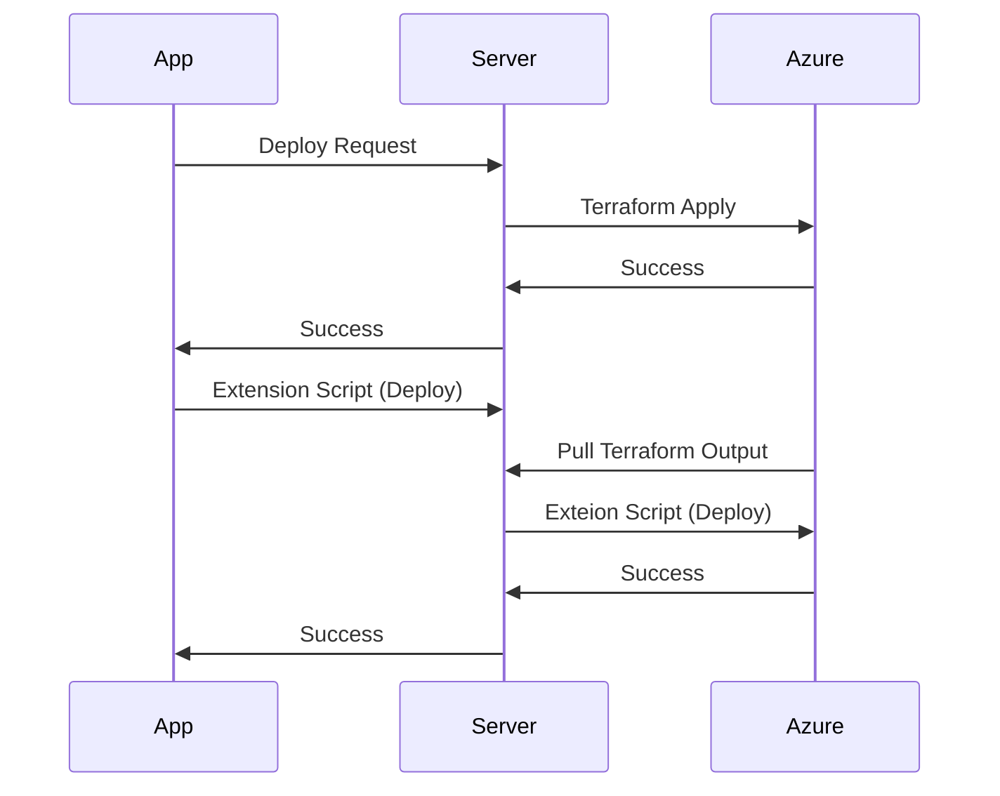
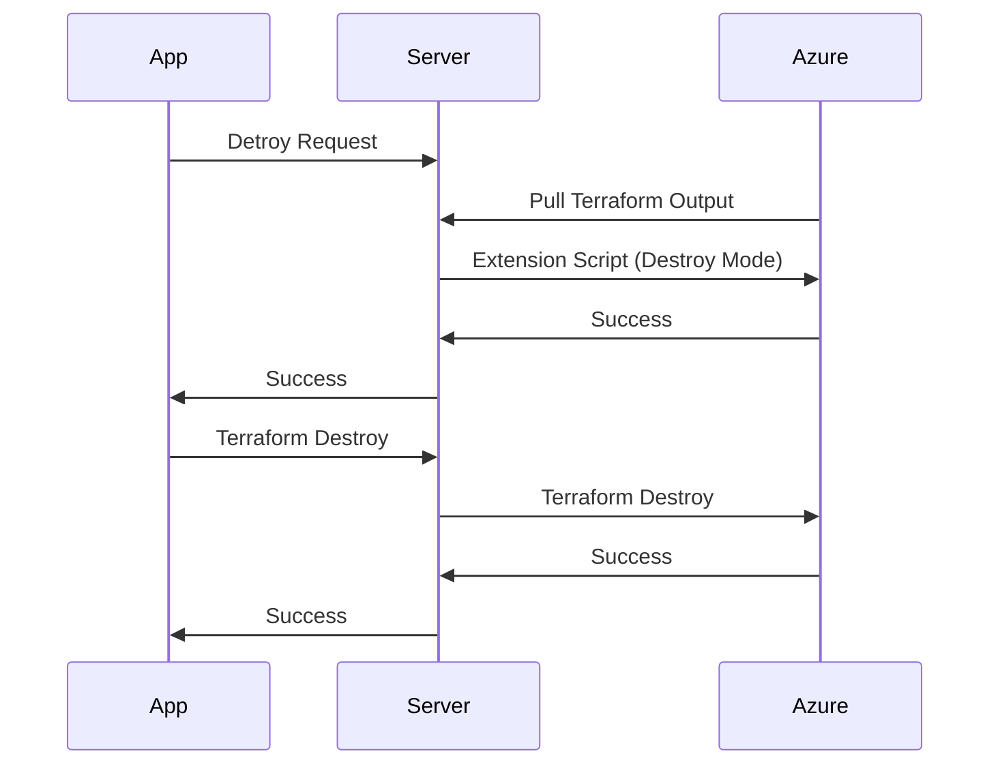

# One Click AKS : Simplest way to deploy Complex AKS Cluster.

Deploying Azure Kubernetes Cluster is really easy. You can create production grade cluster with couple CLI commands. So what this project brings to the table you ask.

There are hundereds of ways that an AKS cluster can be deployed in and then thousands more to configure and meet your unique requirements. If you have to deploy AKS with differnet configurations over and over again its no more an easy task. Along comes this project.

This project runs locally on your computer and deploys AKS cluster in many different ways. (not all)

## What you need?

You need a computer with docker installed on it. You can install that using instructions in docker docs. https://docs.docker.com/desktop/

## How to run?

After docker is installed and running on your system. You can run following command in your favourtive CLI

`docker run --pull=always -it -p 3000:3000 -p 8080:8080 ashishvermapu/repro`

After the app starts running you can access it using http://localhost:3000 from your browser.

## Under the hood.

# Extension Script.

Extension script gives you the ability to go beyond what this tool can do out of the box and be really creative. You can use this to do everything that can be done using Azure CLI. Some examples use cases are:

-   Pulling an image from docker hub to your ACR.
-   Deploy an application to Kubernetes cluster.
-   Adding additional node pools to your cluster.
-   Ordering food online for free. Well, not that, but you get the idea.

## How this works?

This script runs in two primary modes.

-   Deploy
-   Destroy

### Deploy (Extend) Mode

When click '**Deploy**' button, the base infra is deployed using terraform code. After that completes successfully, extension script is deployed. Both these steps happen automatically in order. Since extension script runs after terraform apply is finished. It has access to terraform output.

When running in deploy (extend) mode, 'extend' function is called.

```
function extend()  {
	# Add your code here to be executed after apply
	ok "nothing to extend"
}
```



### Destroy Mode

When click '**Destroy**' button, first, extension script runs in destroy mode, and lets you delete the resources that were created in deploy mode. Or do any other activity that must be done gracefully before resources are destroyed.

When running in destroy mode, 'destroy' function is called.

```
function destroy()  {
	# Add your code here to be executed before destruction
	ok "nothing to destroy"
}
```



## Environment Variables.

Following environment variables are available for script to use. There may be other variables that are not in this list. Any terraform output is automatically added as an even variable for extension script. For example, terraform output "resource_group" is automatically added as an env variable "RESOURCE_GROUP". You can see entire terraform output in the deployment logs.

| Variable            | Description                                                                                                                                                                                                         |
| ------------------- | ------------------------------------------------------------------------------------------------------------------------------------------------------------------------------------------------------------------- |
| RESOURCE_GROUP      | Name of the resource group in azure. This is where all resources will be deployed. Please note if you create additional resource groups using extension script you need to manage the deleting in destroy function. |
| ACR_NAME            | Name of the ACR if deployed                                                                                                                                                                                         |
| AKS_LOGIN           | Command to login to the AKS Cluster if deployed                                                                                                                                                                     |
| CLUSTER_NAME        | Name of AKS Cluster if deployed                                                                                                                                                                                     |
| CLUSTER_VERSION     | Version of AKS Cluster if deployed                                                                                                                                                                                  |
| FIREWALL_PRIVATE_IP | Private IP address of the firewall.                                                                                                                                                                                 |
| NSG_NAME            | Name of the NSG associated with subnet where AKS cluster is deployed, you can use this to add/remove rules using extension scripts"                                                                                 |
| LOCATION            | This is the Azure Region where the resources are deployed. None of the resources are given region exclusively. They all inherit it from resource group.                                                             |
| VNET_NAME           | Name of the virtual network.                                                                                                                                                                                        |
| CLUSTER_MSI_ID      | Clusters managed identity ID.                                                                                                                                                                                       |
| KUBELET_MSI_ID      | Kubelet's managed identity                                                                                                                                                                                          |

## Shared Functions

There are few things that almost all scripts will do. We are aware of these and added them as shared functions which are available to the script and are ready for use.

-   Loging
    `function log()`
    Args: "string"
    Example: `log "this statement will be logged"`

-   Green (OK) Logging
    `function ok()`
    Args: "string"
    Example: `ok "this statement will be logged as INFO log in green color"`

-   Error Logging
    `function err()`
    Args: (String)
    Example: `err "this error occrured"`

In addition to these, we figured that there are few things that we will be doing over and over again in extension scripts. Ultimate goal is to add them as a flag (Switch Button) and make part of terraform, but as an interim solution they are provided as shared functions.

-   Deploy ARO Cluster
    `function deployAROCluster()`
-   Delete ARO Cluster
    `function deleteAROCluster()`
-   Deploy Ingress Nginx Controller.
    `deployIngressNginxController()`
-   Deploy Dummy App (HTTPBIN)
    `function deployHttpbin()`
