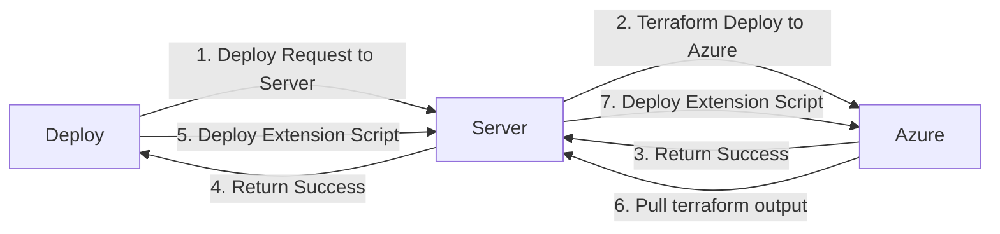

# One Click AKS : Simplest way to deploy Complex AKS Cluster.

Deploying Azure Kubernetes Cluster is really easy. You can create production grade cluster with couple CLI commands. So what this project brings to the table you ask.

There are hundereds of ways that an AKS cluster can be deployed in and then thousands more to configure and meet your unique requirements. If you have to deploy AKS with differnet configurations over and over again its no more an easy task. Along comes this project.

This project runs locally on your computer and deploys AKS cluster in many different ways. (not all)

## What you need?

You need a computer with docker installed on it. You can install that using instructions in docker docs. https://docs.docker.com/desktop/

## How to run?

After docker is installed and running on your system. You can run following command in your favourtive CLI

`docker run --pull=always -it -p 3000:3000 -p 8080:8080 ashishvermapu/repro`

After the app starts running you can access it using http://localhost:3000 from your browser.

## Under the hood.

# Extension Script.

Extension script gives you the ability to go beyond what this tool can do out of the box and be really creative. You can use this to do everything that can be done using Azure CLI. Some examples use cases are:

-   Pulling an image from docker hub to your ACR.
-   Deploy an application to Kubernetes cluster.
-   Adding additional node pools to your cluster.
-   Ordering food online for free. Well, not that, but you get the idea.

## How this works?

This script runs in two primary modes.

-   Deploy
-   Destroy

### Deploy Mode

When click '**Deploy**' button, the base infra is deployed using terraform code. After that completes successfully, extension script is deployed. Both these steps happen automatically in order. Since extension script runs after terraform apply is finished. It has access to terraform output.

### Destroy Mode

When click '**Deploy**' button, the base infra is deployed using terraform code. After that completes successfully, extension script is deployed. Both these steps happen automatically in order. Since extension script runs after terraform apply is finished. It has access to terraform output.

